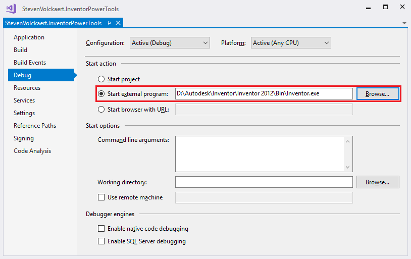
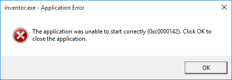

# Inventor® Power Tools

**Inventor® Power Tools** is a collection of productivity tools for Autodesk Inventor® 2012, distributed as an
add-in. It automates some common, repetitive tasks, like generating drawings for each part in an assembly.

After generation, each drawing is left open in the editor, giving the engineer the opportunity to further
adapt them, if necessary.

## Forking and compiling from source

Since Autodesk Inventor® 2012 is built on the .NET Framework 3.5, the project targets `.NET Framework 3.5`.
This framework is not installed by default on Windows 8, Windows 8.1 or Windows 10, meaning you need to
install it manually in order to compile from source. [Installing the .NET Framework 3.5 on Windows 8,
Windows 8.1 and Windows 10][1] explains how to do this.

Using this method didn't work for me on Windows 10, but I managed to install .NET Framework 3.5 using the
`DISM.exe` tool. See [Can't install .NET 3.5 on Windows 10](http://superuser.com/q/946988/319367) on
StackExchange for more information.

## Installation

Each [release][2] contains a `.txt` file with installation instructions.

**In summary:**

1. Close Autodesk Inventor®;
2. Extract the contents of the ZIP file to directory `C:\ProgramData\Autodesk\Inventor 2012\Addins\`;
3. Start Autodesk Inventor®.

## Debugging

To debug the addin with Inventor 2012, do the following:

- Set project `StevenVolckaert.InventorPowerTools` as *startup project*.
- In the project properties of `StevenVolckaert.InventorPowerTools`, set the *Start action* to **Start
  external program** and select the path to `Inventor.exe`.

  

- Finally, hit `F5` to start debugging or `Ctrl+F5` to run.

## License

Inventor® Power Tools is licensed under the [MIT license](LICENSE).

## Installing Inventor 2012 on Windows 8.1 or Windows 10

I experienced problems running Inventor on Windows 10. After successful installation, launching Inventor
stopped immediately with error code `0xc0000142`:

I've found the solution to this problem in the Autodesk Community topic [Autodesk Inventor 2012 does not run
on Windows 10][3].

In a nutshell, the installation procedure on Windows 8.1 or Windows 10 is as follows:

1. Install Autodesk Inventor 2012;
2. Install [Autodesk Inventor 2012 Service Pack 2][4];
3. Install [Update 4 for Inventor 2012 SP2][5];
4. Install [Hotfix - Inventor 2012 unexpectedly exits after updating to Windows 8.1][6].

## See also

* [Inventor® Power Tools releases][2]

[1]: https://msdn.microsoft.com/en-us/library/hh506443%28v=vs.110%29.aspx
[2]: https://github.com/stevenvolckaert/autodesk-inventor-powertools/releases
[3]: https://forums.autodesk.com/t5/installation-licensing/autodesk-inventor-2012-does-not-run-on-windows-10/td-p/6224268
[4]: https://knowledge.autodesk.com/search-result/caas/downloads/content/autodesk-inventor-2012-service-pack-2.html
[5]: https://knowledge.autodesk.com/search-result/caas/downloads/content/update-4-for-inventor-2012-sp2.html
[6]: https://knowledge.autodesk.com/support/inventor-products/downloads/caas/downloads/content/hotfix-inventor-2012-unexpectedly-exits-after-updating-to-windows-81.html
